# Как это работает — гид для клиента

> Простой и понятный разбор: что делает сервис, как заказывается проверка, что именно происходит с вашим будущим автомобилем, и какой отчёт вы получаете в итоге.
>
> _Это документ для пользователей и заказчиков, **без технических деталей**. Если нужна техническая логика и API — она лежит рядом, в `/docs/inspector-logic/`._

---

## Содержание

1. [О сервисе в двух словах](#1-о-сервисе-в-двух-словах)
2. [Что вы получаете](#2-что-вы-получаете)
3. [Как происходит подбор инспектора](#3-как-происходит-подбор-инспектора)
4. [Шаги клиентского пути](#4-шаги-клиентского-пути-со-скриншотами)
5. [Что именно проверяет инспектор](#5-что-именно-проверяет-инспектор-60-точек-проверки)
6. [Откуда берётся фото и как мы защищаем вас от подделки](#6-откуда-берётся-фото-и-как-мы-защищаем-вас-от-подделки)
7. [Как формируется итоговая оценка](#7-как-формируется-итоговая-оценка-0-10)
8. [Как выглядит готовый отчёт](#8-как-выглядит-готовый-отчёт-pdf)
9. [Гарантии и страховка от ошибок](#9-гарантии-и-страховка-от-ошибок)
10. [Частые вопросы](#10-частые-вопросы)

---

## 1. О сервисе в двух словах

Вы хотите купить подержанный автомобиль, но не доверяете продавцу и не хотите ехать смотреть машину сами?

**Мы пришлём независимого инспектора в город, где стоит авто.**
Он осмотрит машину по структурированному чек-листу из **60 точек проверки**, сделает фотографии, снимет VIN, одометр и документы, выставит оценку — и пришлёт вам подробный отчёт **с фотографиями и рекомендацией: покупать, торговаться или не брать**.

Это похоже на «вторую пару глаз», только глаза эти — обученный профессионал с фотоаппаратом, OBD-сканером и доступом к нашей системе контроля качества.

---

## 2. Что вы получаете

После того как инспектор завершит работу, вам приходит:

- ✅ **Подробный PDF-отчёт** (RU / DE / EN) с фотографиями каждой проверенной зоны
- ✅ **Оценка 0–10** и одна из трёх рекомендаций:
  - 🟢 **«Можно покупать»** — серьёзных проблем не выявлено
  - 🟡 **«Покупка возможна, но с торгом и осторожностью»** — есть моменты, требующие внимания
  - 🔴 **«Не рекомендуем покупку»** — обнаружены критические проблемы
- ✅ **Список плюсов** (что осмотрено и в порядке)
- ✅ **Список замечаний** с фотографиями (царапины, запотевания, износ, перекраска)
- ✅ **Список критических находок** — то, на что вы должны обратить внимание прямо сейчас (скрутка пробега, ошибки двигателя, проблемы с документами)
- ✅ **VIN и одометр**, считанные с фотографий — мы расшифровываем их через ИИ и инспектор проверяет результат вручную
- ✅ **Расхождения** между объявлением и реальностью (если в объявлении 142 000 км, а инспектор снял 187 000 — вы это увидите)

---

## 3. Как происходит подбор инспектора

Внутри системы это работает автоматически, но для вас это выглядит так:

1. Вы создаёте заявку и указываете город.
2. Система **сразу видит**, кто из инспекторов работает в этом городе и сколько у них активных заявок.
3. Заявка предлагается **подходящему по локации, опыту и репутации** инспектору.
4. Инспектор подтверждает заявку → вы получаете уведомление «Инспектор назначен» с его именем, рейтингом и количеством завершённых проверок.
5. Если инспектор не отвечает в установленное время — заявка **автоматически переадресуется** другому.

Так выглядит карта городов, в которых сейчас активны инспекторы (на скриншоте — Германия, видны Berlin/Aachen/Augsburg/Bielefeld/Bochum/Bonn/Bremen/Dortmund/Dresden/Duisburg/Düsseldorf):

> На примере Berlin вы видите подпись «3 workshops» — значит, в городе уже подключены реальные мастерские и инспекторы. В городах с пометкой «Looking for inspectors (may take longer)» проверка тоже доступна, но может занять больше времени, пока мы найдём свободного специалиста.

---

## 4. Шаги клиентского пути (со скриншотами)

### 🚪 Шаг 1. Зайти в приложение

Главный экран сразу объясняет суть: **«Don't buy a car blind»** — не покупайте машину вслепую. Три понятные кнопки:

- **Find a car** — мы поможем подобрать.
- **Inspect a car** — заказать проверку конкретного авто.
- **Become inspector** — стать инспектором сети.

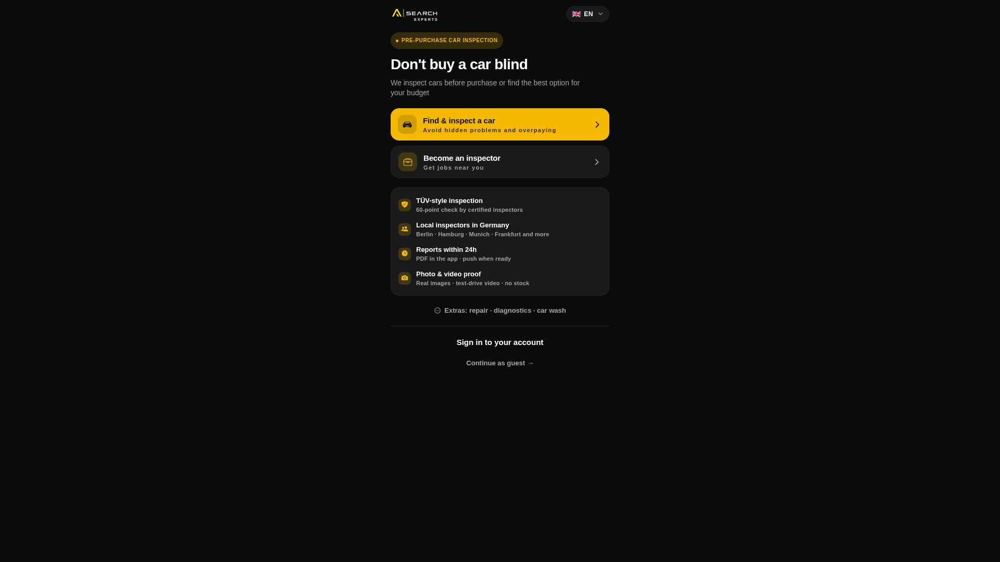

### 🔑 Шаг 2. Войти в свой кабинет

Email + пароль. Или зарегистрироваться, если вы у нас впервые.

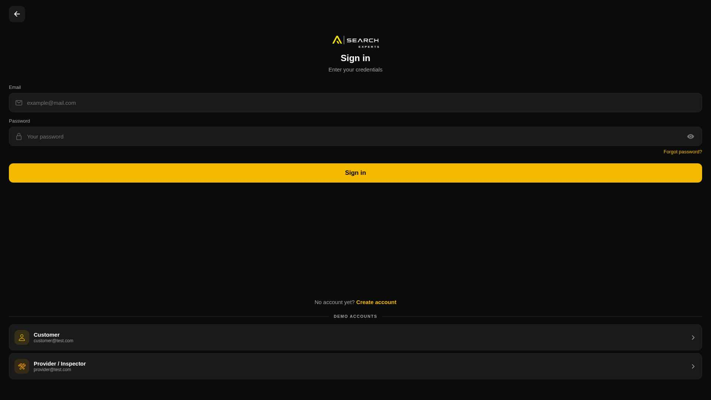

### 🏠 Шаг 3. Личный кабинет

После входа открывается главная: ваши заявки, статусы, рейтинг доверия, кнопка для создания новой проверки. Внизу — навигация: **Home / Requests / Reports / Profile**.

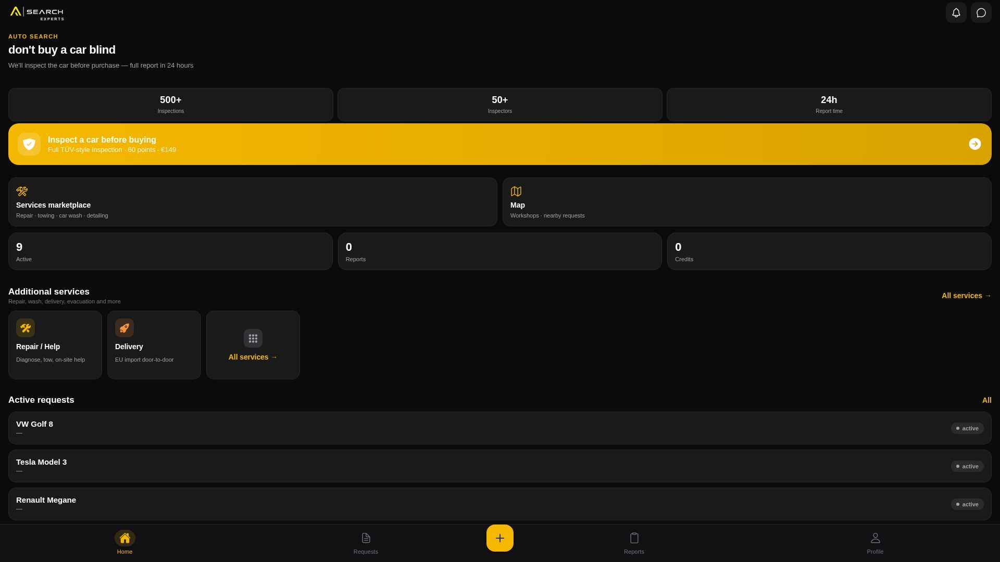

### 📝 Шаг 4. Создать заявку

«Какую проверку вам нужно?» — система предлагает варианты:
- **Стандартная проверка** — 60 пунктов, фото, OBD.
- **Концьерж-импорт** — мы вам подберём авто в Европе, сами его осмотрим и поможем с доставкой и оформлением (только для стран постсоветского пространства).
- **Подбор без покупки** — нужна консультация какую модель брать.

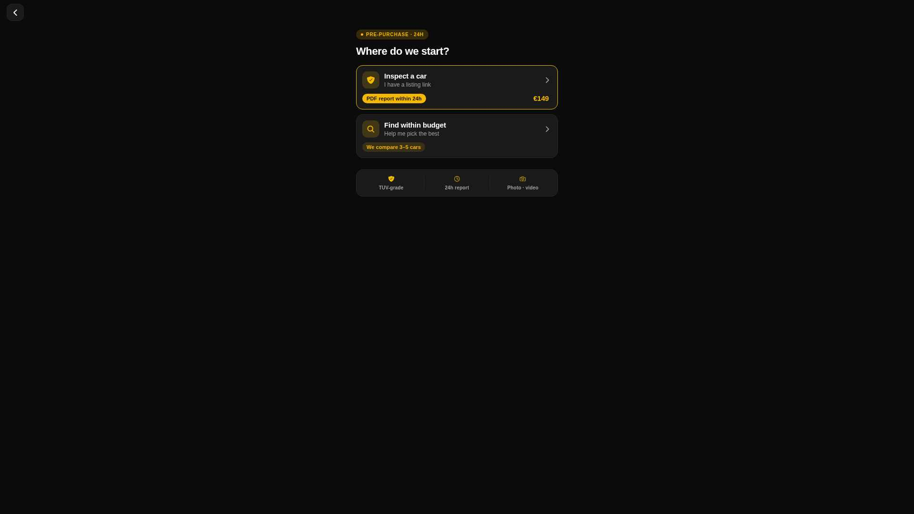

Дальше — простая форма: ссылка на объявление (mobile.de, autoscout24 и т.д.), город, желаемая дата осмотра.

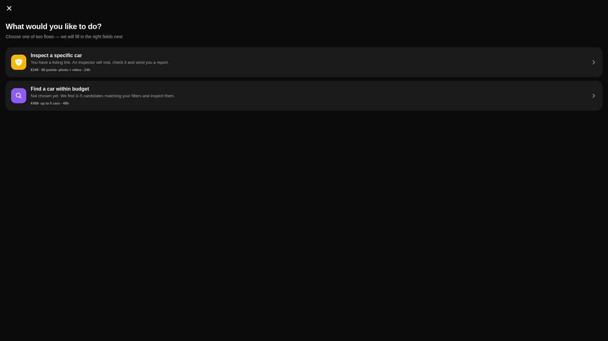

### 📋 Шаг 5. Следить за статусом заявки

Во вкладке «Requests» вы видите все свои заявки и их состояние:
- 🟡 **Pending** — ищем инспектора
- 🔵 **Accepted** — инспектор принял заявку
- 🟢 **Inspecting** — инспектор уже на месте, проверяет
- ✅ **Done** — отчёт готов

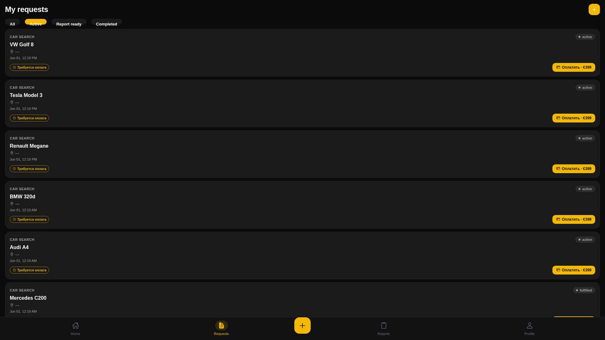

### 🧾 Шаг 6. Получить отчёт

Когда инспектор закончил — отчёт появляется во вкладке «Reports». Сейчас на скриншоте показано пустое состояние (если у вас ещё нет завершённых проверок), с подсказкой: «After the inspector finishes, you'll receive a full report with photos, video and a checklist».

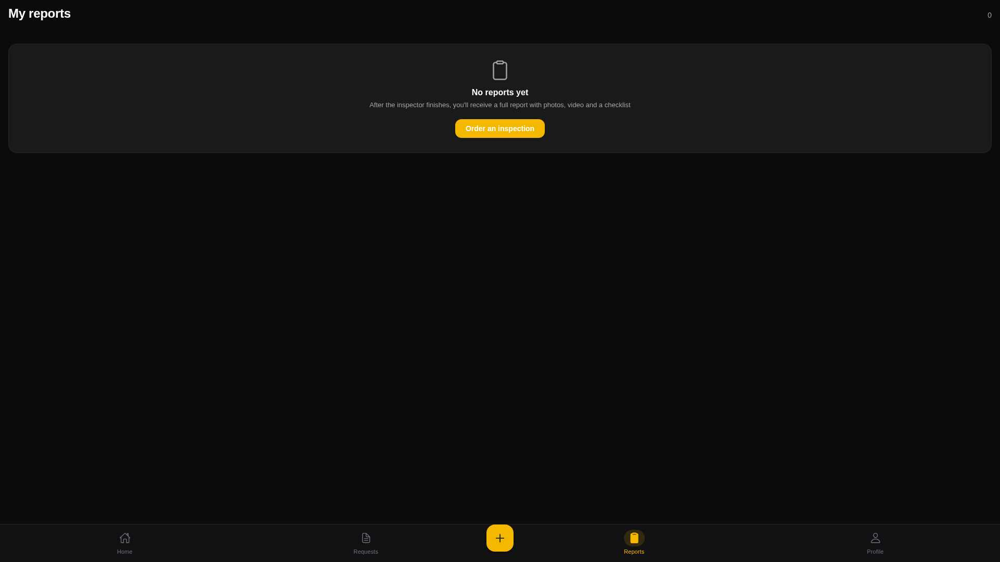

### 🛒 Дополнительно: Marketplace и Services

Помимо проверки авто, у вас есть доступ к:

**Marketplace** — каталог мастерских и сервисов для уже купленного авто:

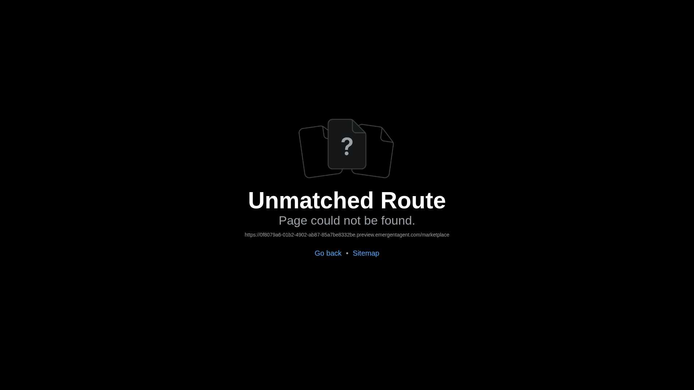

**Services** — 9 категорий услуг: тех. обслуживание, шиномонтаж, кузовной ремонт, диагностика, мойка, эвакуация и т.д. Каждая мастерская — с рейтингом, ценами и отзывами:

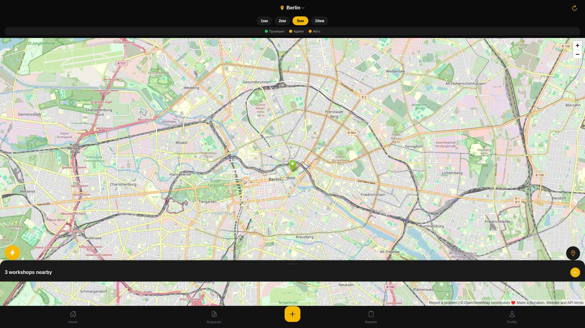

**Garage** — ваши автомобили: история обслуживания, напоминания о ТО, страховке, ТО, замене масла:

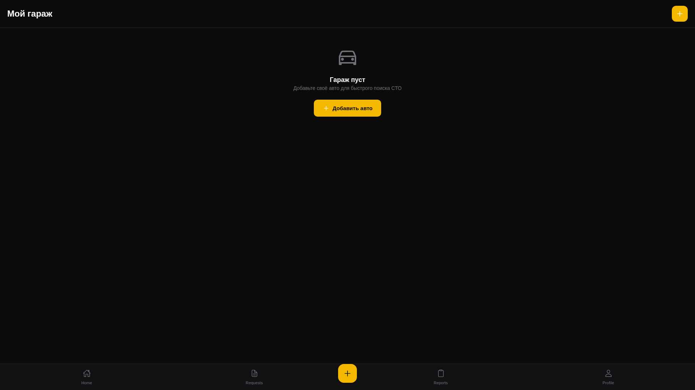

---

## 5. Что именно проверяет инспектор (60 точек проверки)

Инспектор не идёт «посмотреть машину». Он **обязан** пройти **семь секций**, в каждой из которых от 6 до 11 конкретных проверок. Всего — **60 пунктов**.

| Секция | Сколько пунктов | Что входит |
|---|:-:|---|
| 🚘 **Кузов** (Exterior) | 11 | Зазоры панелей, толщина краски, ржавчина, стёкла, фары, зеркала, диски, следы аварии, уплотнители, номерные знаки, осмотр днища |
| 💺 **Салон** (Interior) | 9 | Сидения, обивка, приборная панель, электроника, посторонние запахи, ошибки на приборах, индикатор подушек безопасности, кондиционер, ремни |
| ⚙️ **Двигатель** (Engine) | 10 | Чистота подкапотного, утечки масла и антифриза, уровни жидкостей, холодный пуск, посторонние шумы, ремни и шланги, воздушный фильтр, дым из выхлопа, опоры двигателя |
| 🛞 **Подвеска и тормоза** (Suspension & Brakes) | 9 | Амортизаторы, отклик руля, тормозные диски, толщина колодок, протектор шин, возраст шин, ручник, подшипники, ABS/ESP |
| 🔧 **Диагностика** (Diagnostics) | 6 | OBD-II коды ошибок, состояние АКБ, проверка пробега на скрутку, подозрительные сбросы ECU, готовность мониторов выхлопа, ключ-брелок |
| 🛣️ **Тест-драйв** (Test Drive) | 8 | Все передачи КПП, ускорение, торможение, вибрации на скорости, увод руля, круиз-контроль, парктроник, кондиционер под нагрузкой |
| 📄 **Документы** (Documents) | 7 | VIN ↔ свидетельство, фото одометра, регистрационный документ, история обслуживания, число владельцев, ТО (TÜV/MOT), проверка на отзывы |

### Из этих 60 пунктов:
- **23 пункта** требуют **обязательной фотографии**. Без фото инспектор не сможет сдать отчёт.
- **3 пункта** — **сверх-критичные** (VIN, одометр, регистрационный документ). Без правильных фото этих трёх пунктов отчёт **не отправится в принципе**. Никакой override. Никаких «забыл сфотографировать». Это ваша защита от халтуры.

---

## 6. Откуда берётся фото и как мы защищаем вас от подделки

### 6.1. Каждое фото снимается **в нашем приложении**, через специальную камеру

Инспектор не может загрузить «фото из галереи» или прислать вам картинку из интернета. Когда он нажимает «Сделать фото» рядом с пунктом «VIN matches registration» — открывается **наша гайдед-камера** с рамкой именно под VIN-номер (длинная горизонтальная). Если инспектор не направит камеру на VIN — рамка останется пустой.

Те же специальные рамки есть для:
- одометра (горизонтальный прямоугольник под цифры пробега)
- документов (вертикальная рамка A4)
- повреждений (квадрат)
- шин, OBD-сканера, подкапотного пространства

### 6.2. Каждое фото получает **«отпечаток»** и геолокацию

Сразу после съёмки мы сохраняем:
- **sha256-хеш** содержимого фото (как «отпечаток пальца»)
- **геолокация** (где было сделано фото)
- **время** съёмки
- **модель устройства** инспектора

Это означает: если кто-то попробует сдать **одно и то же фото в две разные проверки** — мы это видим автоматически. Если фото VIN снято в Берлине, а фото одометра — в Мюнхене — мы это видим. Если фото VIN снято за неделю до даты бронирования — мы это видим.

### 6.3. Качество фото проверяется автоматически

Приложение прямо на телефоне инспектора проверяет:
- 💡 **Освещение** — не слишком темно и не слишком ярко (без бликов)
- 🔍 **Резкость** — нет ли размытия
- 📐 **Разрешение** — достаточно ли пикселей для разбора деталей

Если фото плохое — инспектор видит **красный сигнал** «Качество фото — есть проблемы» и должен переснять. Если он всё равно решает оставить плохое фото — этот факт сохраняется в журнале для последующего разбора.

### 6.4. VIN и одометр **читает ИИ**

Когда инспектор сфотографировал VIN — **искусственный интеллект** (Gemini 2.5 Flash) распознаёт цифры и буквы автоматически. Инспектор видит подсказку «Распознано: WVWZZZ1JZXW000123, уверенность 96%» — и должен либо подтвердить, либо исправить.

Это значит:
- Инспектор **не вводит VIN руками** (что исключает случайные опечатки).
- ИИ сверяет VIN со стандартным форматом ISO 3779 (17 символов, без I/O/Q).
- Одометр читается из фото и пересчитывается из миль в километры, если надо.
- Считанный VIN и одометр потом **сверяются с объявлением** (если в объявлении 142 000 км, а на одометре 187 000 — система автоматически подсветит это расхождение).

### 6.5. Журнал всех действий

Каждое действие инспектора во время проверки записывается в **журнал событий**:
- «Inspection started 11:42»
- «Photo uploaded: VIN (context: vin) 11:48»
- «OCR detected: WVWZZZ1JZXW000123 (96%) 11:48»
- «Inspector confirmed VIN 11:49»
- «Item flagged warning: paint thickness (note: «Перекрашена правая дверь, толщиномер 280 мкм vs 130 мкм по машине») 12:14»
- «Report submitted: score 8.0, recommendation buy_with_caution 13:05»

Этот журнал **не доступен инспектору на редактирование**. Если возникнет спор — мы видим всю хронологию.

---

## 7. Как формируется итоговая оценка (0–10)

Шкала простая.

```
Начальная оценка:   10.0
─────────────────────────────────────────
Каждое критическое замечание:  -2.0 балла
Каждое предупреждение:         -0.4 балла
ОК / Не применимо:              без изменения
─────────────────────────────────────────
Итоговая оценка =     [0 .. 10]
```

### Рекомендация инспектора зависит не только от баллов:

| Условие | Рекомендация | Что это значит для вас |
|---|---|---|
| **Есть хотя бы одно «критическое»** | 🔴 **Avoid (не брать)** | Независимо от итоговой оценки, если есть хоть одна красная находка — не рекомендуем. |
| Score ≥ 8.0, нет критических | 🟢 **Buy (можно покупать)** | Машина в хорошем состоянии. Серьёзных проблем нет. |
| Score 5.0 – 7.9, нет критических | 🟡 **Buy with caution (с осторожностью)** | Есть моменты, но не блокирующие. Используйте как аргумент для торга. |
| Score < 5.0 | 🔴 **Avoid (не брать)** | Слишком много мелких проблем — высокий риск. |

### Пример (из тестового отчёта в этом репозитории):

```
60 пунктов проверены
✅ 59 OK / N/A
🟡 0 warnings  (в нашем тесте — но обычно бывает 1-3)
🔴 1 critical: «OBD одометр 187 432 км, показывает 142 800 км — скрутка»

Score = 10.0 - 2.0×1 - 0.4×0 = 8.0
Recommendation = avoid (потому что есть critical — пробег скручен)
```

Видите? Оценка 8.0 (вроде высокая), но рекомендация — **не брать**. Потому что скрутка пробега — это деал-брейкер. Машину можно реанимировать, но переплачивать за «свежий» километраж — нет.

---

## 8. Как выглядит готовый отчёт (PDF)

Когда инспектор закончил — система автоматически собирает **PDF-отчёт**, готовый к скачиванию, печати и отправке третьим лицам (например, юристу или родственнику, который реально поедет забирать машину).

### Обложка с итогом

Первая страница сразу даёт ответ на главный вопрос «брать или не брать» — оценка, рекомендация, ключевые цифры (VIN, пробег, дата проверки):

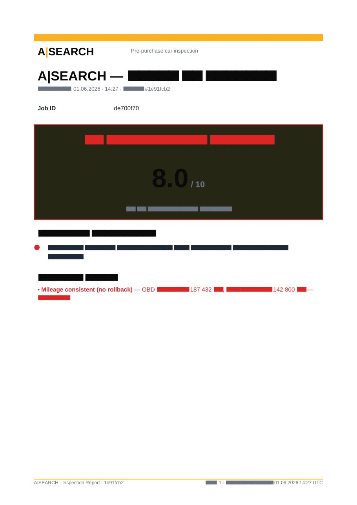

### Сводка по секциям

Каждая секция (кузов, салон, двигатель и т.д.) — отдельным блоком с цветовой индикацией:

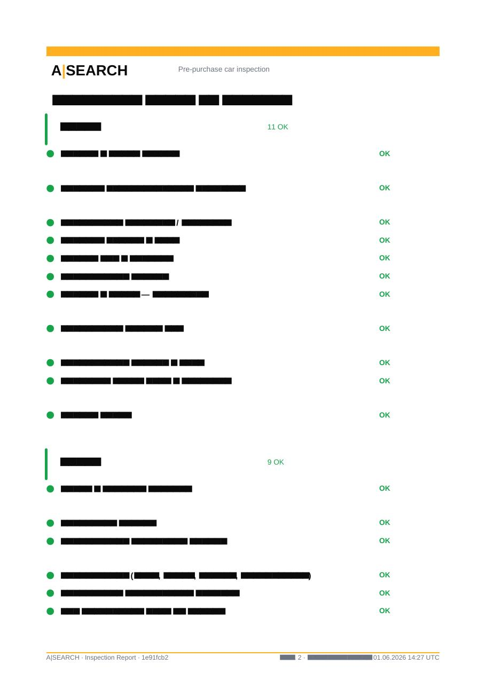

### Детали по каждому пункту с фотографиями

Для каждой проверки — статус, заметка инспектора и до 4 фотографий (миниатюры 36 мм, кликабельно в PDF при просмотре):

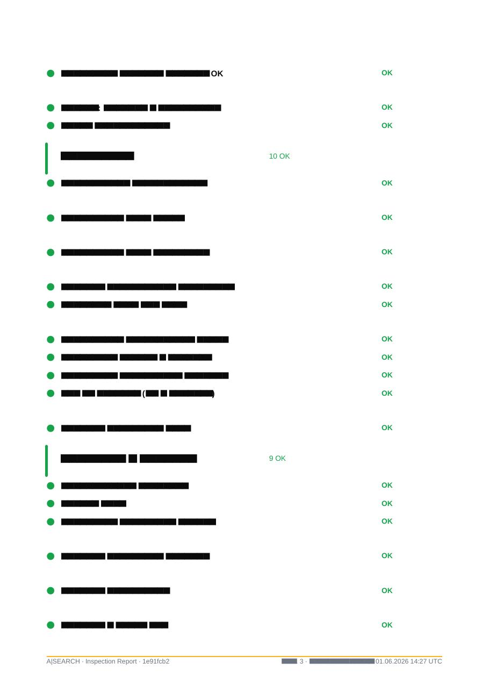

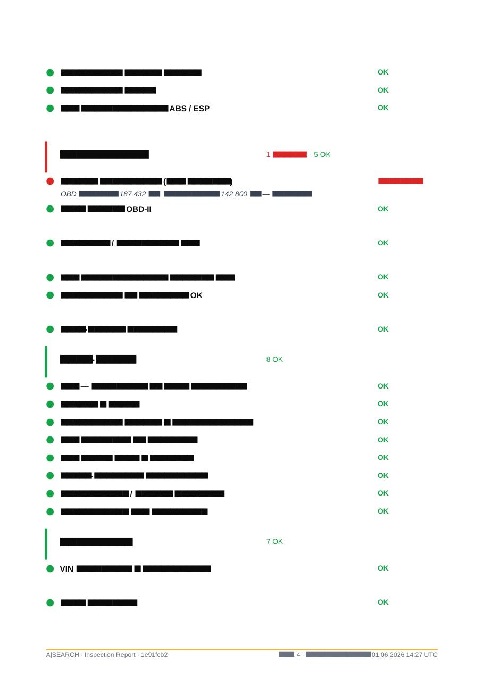

### Критические находки и предупреждения

Отдельный раздел с фотографиями и пояснением инспектора, что не так:

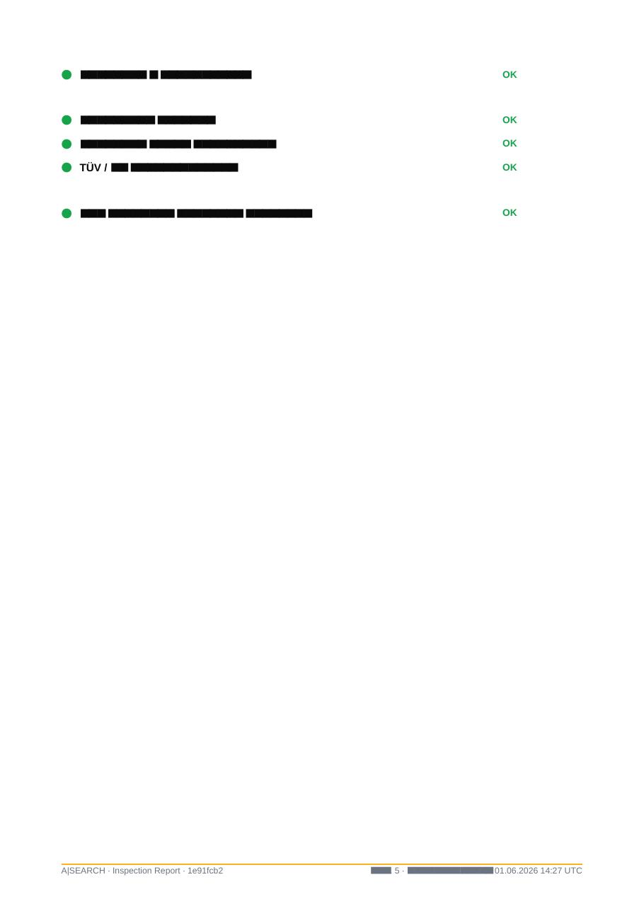

### Документы и VIN

Финальная страница — фото VIN, одометра, регистрации, история обслуживания:

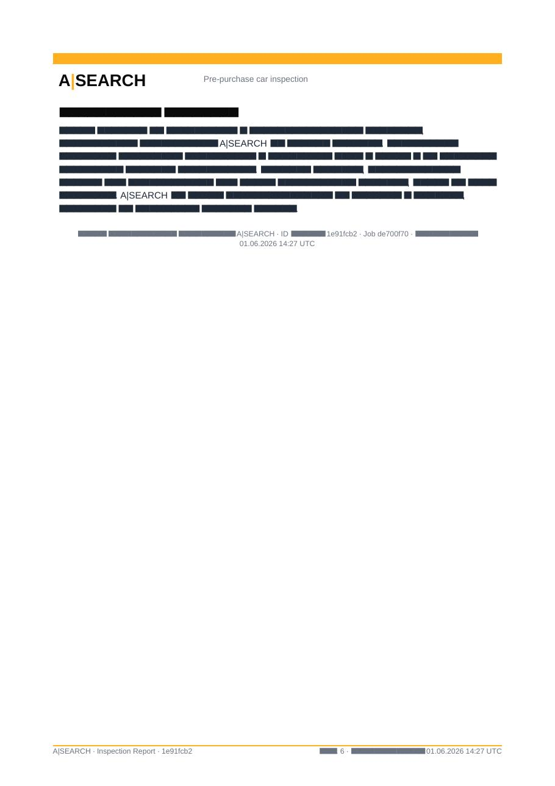

> 📌 **Размер отчёта обычно 5–10 МБ.** Можно отправлять по почте, в мессенджере, печатать.
> 📌 **Языки:** русский, английский, немецкий (PDF доступен на всех трёх — выбираете при скачивании).

---

## 9. Гарантии и страховка от ошибок

Что если инспектор что-то пропустил, ошибся или вы не согласны с оценкой?

### 9.1. Эскроу — деньги не уходят инспектору сразу

Когда вы оплачиваете проверку — деньги **замораживаются** на нашем счёте (Stripe Connect). Инспектор получает их только **после того, как вы посмотрели отчёт и подтвердили, что всё ок**. Если есть проблема — деньги остаются у нас, пока спор не разрешится.

### 9.2. Диспуты — официальный спор

Если что-то не так:
- Не пришло фото обещанного пункта
- Инспектор написал «ок», а оказалось, что есть скрытая проблема, заметная при простом осмотре
- Качество отчёта явно низкое

Вы можете **открыть диспут** прямо из приложения. Спор рассматривает **наш админ-арбитр** (не инспектор и не вы). Все доказательства уже есть в системе: журнал событий, отпечатки фото, геолокация, время каждого действия. Решение — в течение 48 часов.

### 9.3. Рейтинг и обратная связь — слепое раскрытие

После каждой проверки вы можете оценить инспектора и оставить отзыв. **Инспектор не видит ваш отзыв до тех пор, пока сам не оставит свой** — так мы исключаем «торг отзывами». Когда оба оставили — отзывы раскрываются одновременно.

### 9.4. Жёсткое требование на трёх ключевых фото

Напомню — **VIN, одометр и регистрационный документ** жёстко обязательны. Инспектор **физически не сможет** сдать отчёт без них, даже если очень захочет. Это — ваша «нижняя планка качества»: вы всегда получаете эти три фото.

---

## 10. Частые вопросы

**❓ Сколько времени занимает проверка?**
В среднем 1.5–2 часа на месте + ~1 час на сборку отчёта. От момента создания заявки до получения отчёта обычно проходит **1–2 рабочих дня**, если в вашем городе есть свободные инспекторы.

**❓ Если инспектора в моём городе нет — что делать?**
В системе пока не во всех городах есть свободные инспекторы. В таких городах сейчас стоит пометка «Looking for inspectors». Вы всё равно можете создать заявку — мы постараемся найти специалиста, но это может занять несколько дней. Если в течение 7 дней не получится — деньги возвращаются.

**❓ Что если на машине нет двигателя в обычном смысле (электромобиль)?**
Инспектор отмечает нерелевантные пункты как **N/A (не применимо)** — они не влияют на оценку. Шаблон в будущем будет адаптироваться под тип ТС (отдельные шаблоны для EV, гибрида, мотоцикла) — пока используется единый.

**❓ Я могу попросить инспектора снять видео?**
Сейчас в шаблоне видео не предусмотрено — только фото. Видео-walkaround (общий обзор машины 30–60 сек) запланирован в ближайших обновлениях.

**❓ Можно ли заказать «срочную проверку»?**
Да, при создании заявки вы можете отметить «срочно» — мы попробуем найти инспектора с приоритетом и в течение нескольких часов. Это влияет на цену.

**❓ Что произойдёт, если я не отвечу инспектору?**
Если инспектор пытается уточнить детали (например, точное место встречи) и вы не отвечаете в течение 24 часов — заявка приостанавливается, деньги остаются в эскроу. Возобновится сразу после вашего ответа.

**❓ Где хранится мой VIN и фотографии моей будущей машины?**
В нашей зашифрованной базе данных в Германии. Никаких сторонних сервисов. Вы можете удалить свои данные в любой момент из раздела «Profile → Privacy».

---

## Резюме одним абзацем

**Вы создаёте заявку → мы находим вам независимого инспектора → он приезжает к машине с нашим приложением, проходит 60 точек проверки с фотографиями, наша система автоматически читает VIN и одометр через ИИ, сверяет с объявлением и проверяет качество фото → мы собираем красивый PDF-отчёт с оценкой 0-10 и рекомендацией «брать / торговаться / не брать» → деньги уходят инспектору только после вашего подтверждения → если есть спор, у нас уже есть весь журнал действий с геолокацией и отпечатками фото для арбитража.**

---

_Документ актуален на 2026-06-01. Если что-то непонятно — пишите в поддержку прямо из приложения (Profile → Support)._

_Технические детали для разработчиков и QA — в `/docs/inspector-logic/README.md`._
